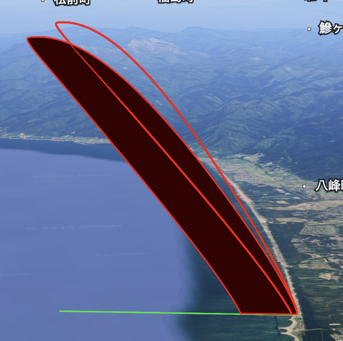

# 新飛行シミュ解説
## 概要
オープンソースの6DoF FDMのJsbSimを使用したロケット飛行シミュレータ

**JSBSim**  
- 航空宇宙機全般の動力学をシミュレーションするための、オープンソースのC++製ソフトウェアライブラリ
- ロケットやミサイル、無人航空機（UAV）などのシミュレーションにも広く活用  
- NASAの比較によりNASA内部で開発・使用されている専門的なソフトウェアに比べ「公開された全てのケースにおいて、大多数のツール間で一致を示すのに十分」

**Config**
- JSBSimは独自のXML形式でシミュレーションを設定
  - Simulation: ソルバの設定、タイムステップおよび飛行中のイベント
  - Launch/Liftoff: 初期状態の宣言
  - Rocket: ロケットのパラメータ、重量重心、空力定数
- jsbsim_supportフォルダの関数群でXML形式を生成
  - 設定ファイル: 固定のパラメータと、可変パラメータのテーブルを指定
  - テーブル: マッハ数による効力係数変化などのテーブル

**Summarize**
- シミュレーション結果の集計等を行う
  - GustWind: 横風突風時のAoAや対気速度を計算
  - Extrema: 最高速度、最高高度、最大動圧など複数の極点を抽出
  - LandingRange: 落下範囲のテーブルを生成
  - FinalPoints: 落下円のcsvファイルを生成
  - KML: 落下範囲のKMLファイルを生成

## 旧TrajecSimとの変化点
- 積分方式の変化
  - Scipy ODEint
- エンジン作動中の効力係数変化の削除
  - エンジン作動中に効力係数が固定で0.1下がる動作の削除
- ピッチ安定微係数の計算修正
  - 機体の代表面積、長さがピッチ安定微係数の計算に用いられるように  
- エンジンデータの読み込みを変更
  - 入力データのうちエンジン作動前の状態でも正しく動作するように変更
- パラシュート挙動の変更
  - パラシュート開傘後も、機体の空力的な特性が動作するように

**軌道変化**
  
図1. 飛行軌道変化  
黒く塗りつぶされたものが旧シミュレーション  
機体本体の影響によるわずかな効力の増加および上昇中の風見効果によって軌道に変化が発生

